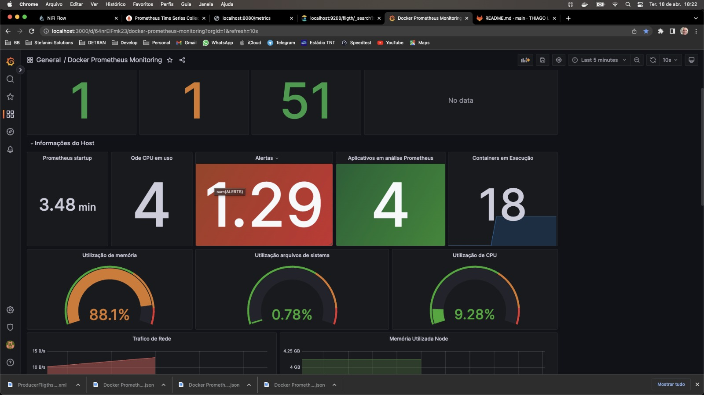

# World Wide Departure Fligths Analysis using Big Data Technologies
## Overview
This pipeline is designed for real-time analysis of fligths specifically for **Desafio BB**, utilizing big data technologies for efficient processing and analysis. The pipeline ingests tweets in real-time using **Apache Kafka**, which allows for high-throughput data collection. The tweets are then stored in **Elasticsearch** for efficient indexing and querying. **Apache NiFi** is used for data flow management, ensuring that the tweets are properly routed and transformed as they move through the pipeline. The tweets are and visualized using **Kibana** for easy understanding and insights. **With this pipeline, users can quickly and effectively analyze large volumes of ChatGPT-focused tweets in real-time.**




## Pre-Requisites

- install docker [https://docs.docker.com/engine/install/](https://docs.docker.com/engine/install/)
- install docker-compose [https://docs.docker.com/compose/install/](https://docs.docker.com/compose/install/)

## Usage

Clone the projet:

```
git clone https://gitlab.com/ticoleite80/desafio-bb.git
cd desafio-bb
```

Start the cluster:

```
docker-compose -f 'docker-compose.yml' up --build -d
```

after running the cluster, you can check the running containers using: 
```
docker ps
```

| container name | url                    |
|----------------|------------------------|
| `apache nifi`  | https://localhost:8443 |
| `kafka`        | https://localhost:9092 |
| `elastisearch` | https://localhost:9200 |
| `prometheus`   | https://localhost:9090 |
| `cadvisor`     | https://localhost:8080 |
| `grafana`      | https://localhost:3000 |


para terminar os processos em execução basta executar o comando:

```
docker-compose down
```

Conceitos básicos

**Containers**: Ambiente isolado, disposto em um servidor, com um unico host de controller, onde cada ambiente eh criado com uma unica responsabilidade, objetivando eficiencia e escalabilidade.

**Maquina Virtual**: Ambiente isolado onde é possível utilizar diversos recursos e ferramentas, sendo executado em um mesmo sistema operacional e, em caso de pane, todas as fiuncionaliaddes em execução são afetadas.

**Imagens Docker**: Definem a aplicação disponível no Docker(container), contendo codigos, bibliotecas, ferramenas, dependencias, dentre outros, para a execução de um aplicativo. esta podendo se tornar uma ou várias instâncias de um container.

**Docker**: Plataforma de criação e execução de containers, que compratilham um mesmo Host (maquina hospedeira), com um modelo de implantação com base em imagens.

**Docker-compose**: Arquivo de configuração do Docker utilizado para execução de vários containers, em um unico comando, otimozando o provisionamento e gerenciamento de multi-containers

**NiFi**: Ferramenta de automatização de fluxo de dados.

**Zookeeper**: Ferramenta de gerenciamento de clusters(maquinas em rede que executam um mesmo processo).

**Kafka**: Ferramenta de transmissão de dados e fluxo de registros em tempo real.

**ElasticSearch**: Ferramenta de busca e análise de dados distribuído, estruturados ou não estruturados, desenvolvido sobre o Apache Lucene.

**Apache Lucene**: Ferramenta de indexação(estrutura de dados inter-relacionada baseada em palavras-chave) e consulta de dados (pelo index criado).

**Cadvisor**: Agente de monitoramento para containers, com suporte nativo do Docker
    **Node-Explorer**: Agente de monitoramento de recusros da maquina host do Docker em execução.

**Prometheus**: Sistema de monitoramento para serviços e aplicações, colatando metricas de alvos configurados, em intervalos, e exibe seus resultados.

**Grafana**: Plataforma de visualização e consulta de metricas por meio de graficos.

Site para obtenção do CLIENT_ID para execução da API:

https://aviationstack.com/dashboard?logged_in=1

API Access Key: 1d9424c5946ff1d1af7bb43e1bb908e2


**Thiago Leite**

Architect Solutions II

**Stefanini GROUP**
